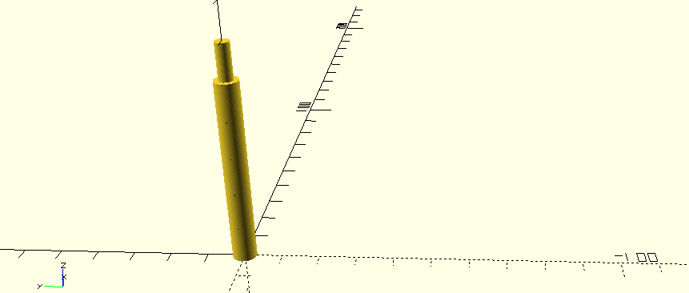

# Singer Spool Pin

Replacement spool pin for a Singer sewing machine.

## Print Settings

- Layer Height: `0.2mm`
- Initial Layer Height: `0.3mm`
- Infill Density: `100%`
- Printing Temperature: `212C`
- Print Speed: `35mm/s`
- Initial Layer Speed: `20mm/s`
- Brim Speed: `10mm/s`
- Brim Width: `10mm`

Total time to print: **33 minutes**